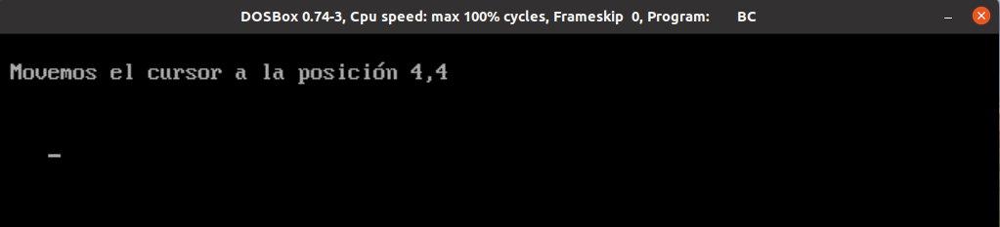
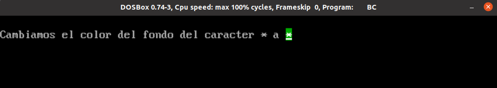
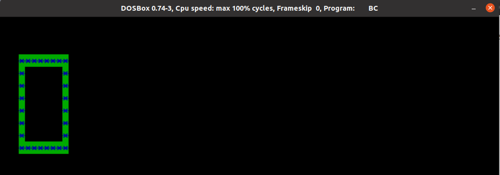

# Práctica 1: E/S con interrupciones en C

Alumnos:

* Alonso Bueno Herrero
* Bartolomé Zambrana Pérez


## Introducción.
Para una mayor facilidad a la hora de ejecutar las funciones de ejemplo hemos implementado un menú, que se muestra en la siguiente captura:


## Ejercicios obligatorios


### `gotoxy(x,y)` 

Para mover el cursor a la posición (x,y) de la pantalla. 

```C
void gotoxy(int x, int y){
	union REGS inregs, outregs;

	inregs.h.ah=2;
	inregs.h.dh=x;
	inregs.h.dl=y;
	inregs.h.bh=0;

	int86(0x10, &inregs, &outregs);
}
```
> Ejemplo de utilización de la función:



### `setcursortype()` 

Fijar uno de los 3 tipos de cursores disponibles. 

```C
void setcursortype(int tipo_cursor){
	union REGS inregs, outregs;
	inregs.h.ah = 0x01;
	switch(tipo_cursor){
		case 0: //invisible
			inregs.h.ch = 010;
			inregs.h.cl = 000;
			break;
		case 1: //normal
			inregs.h.ch = 010;
			inregs.h.cl = 010;
			break;
		case 2: //grueso
			inregs.h.ch = 000;
			inregs.h.cl = 010;
			break;
	}
	int86(0x10, &inregs, &outregs);
}
```
> Ejemplo de utilización de la función:


### `setvideomode(BYTE modo)`

Para establecer el modo de vídeo a usar. Para ver los modos válidos, repasar tabla del guión de la Práctica 1.

```C
void setvideomode(BYTE modo){
	union REGS inregs, outregs;

	inregs.h.ah=0x00;
	inregs.h.al=modo;

	int86(0x10, &inregs, &outregs);
}
```

> Ejemplo de utilización de la función:


###  `getvideotype()` 

Obtener el modo de vídeo actual. 


```C
int getvideomode(){
	union REGS inregs, outregs;

	inregs.h.ah = 0x0f;

	int86(0x10, &inregs, &outregs);
	return outregs.h.al;
}
```

> Ejemplo de utilización de la función:


### `textcolor()` 
Modifica el color de primer plano con que se mostrarán los caracteres

```C
// variable global modificada por la función 'textcolor' y que se usará
//  cuando se vaya a pintar por pantalla
int text_color = 15; 		//Blanco por defecto.

void textcolor(int  color){
	text_color = color;
}
```
> Ejemplo de utilización de la función:


### `textbackground()`

Modifica el color de fondo con que se mostrarán los caracteres.

```C
// variable global modificada por la función 'textbackground' y que se 
//   usará cuando se vaya a pintar por pantalla
int background_color = 0;  	//Negro por defecto.

void textbackground(int color){
	background_color = color;
}
```
> Ejemplo de utilización de la función:



### `clrscr()`

Borrar la pantalla (limpiarla).

```C
void clrscr(){
	int modo; //Variable para mostrar el modo
	int i;
	modo = getvideomode();

	//Realizamos el clear si se encuentra en modo texto, sino no tiene sentido.
	if(modo == 0 || modo == 1 || modo == 2 ||
		 modo == 3 || modo == 7){

		//Todos los modo texto tienen 25 líneas.
		for( i = 0; i < 24 ; i++)
		printf("\n");

		gotoxy(0,0);
	}
}
```
> Ejemplo de utilización de la función:


### `cputchar()`

Escribe un carácter en pantalla con el color indicado actualmente.

```C
void cputchar(unsigned char c){
	union REGS inregs, outregs;
	inregs.h.ah = 0x09;
	inregs.h.al = c;
	inregs.h.bl = background_color << 4 | text_color;
	inregs.h.bh = 0x00;
	inregs.x.cx = 1;
	int86(0x10,&inregs,&outregs);
}
```

> Ejemplo de utilización de la función:


### `getche()`

Obtiene un carácter de teclado y lo muestra en pantalla.

```C
void getche(){
	int temporary;
	temporary = mi_getchar();
	mi_putchar((char)temporary );
printf("\n");
}
```

> Ejemplo de utilización de la función:


## Ejercicios extra (para subir nota)

### Ejercicio 1

La función para pintar el cuadrado se ha hecho mediante dos bucles que imprimen los lados horizontales y  los verticales, respectivamente.

```C

void recuadro(int x1, int y1, int x2, int y2, int color_fondo, int color_fuente){
    int i,j;
    //Establecemos los colores.
    textcolor(color_fuente);
    textbackground(color_fondo);

    
    for(i = 0; i <= (x2 - x1); i++){
        //Lateral derecha.
        gotoxy(x1 + i, y1);
        cputchar('*');

        //Lateral izquierda.
        gotoxy(x2 - i , y2);
        cputchar('*');
    }

    for(j = 0; j <= (y2 - y1); j++){
        //Horizontal superior.
        gotoxy(x1, y1 + j);
        cputchar('*');
        
        //Horizontal inferior
        gotoxy(x2, y2 - j);
        cputchar('*');
    }
}
```

> Ejemplo de utilización de la función:



### Ejercicio 2

La función `pixel` se ha obtenido del material de prácticas. 

Se han dibujado tres puntos en posiciones aleatorias y en colores que sean visibles.

Se ha dibujado un triángulo rectángulo mediante un bucle para ilustrar que funciona el modo gráfico CGA. 

```C
void pixel(int x, int y, unsigned char color){
    union REGS inregs, outregs;

    inregs.x.cx = x;
    inregs.x.dx = y;
    inregs.h.al = color;
    inregs.h.ah = 0X0C;
    int86(0x10, &inregs, &outregs);
}

int main(){
    int i;
    setvideomode(4); //Modo gráfico.

    pixel(10,40,0);
    pixel(10,50,1);
    pixel(15,60,2);
    pixel(20,70,3);

    //Dibujamos un triángulo rectángulo
    for(i = 0; i < 45 ; i++){
        //Base
        pixel(10+i,100, 3);
        //Linea izquierda,
        pixel(10+i,100+i,2);
        //Línea derecha
        pixel(55,100+i,1);
    }

    mi_pausa();

    setvideomode(3); //Modo texto;
    return 0;
}
```


> Ejemplo de utilización de la función:


