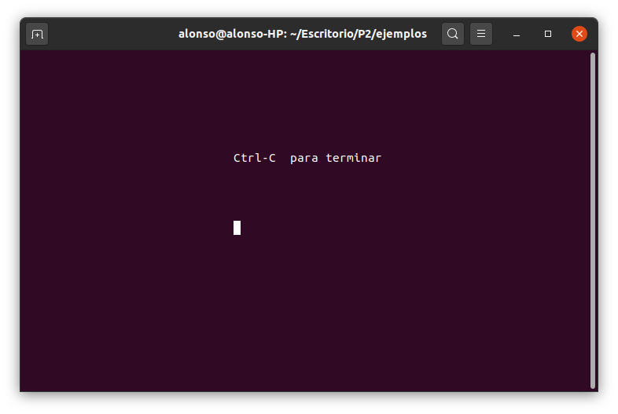

# Práctica 2: Uso de ncurses para crear interfaces de usuario en modo texto bajo Linux.

Alumnos:

* Alonso Bueno Herrero.
* Bartolomé Zambrana Pérez.


Tareas a realizar:

1. Instalar la librería `ncurses`, crear los programas de ejemplo ofrecidos más arriba, y comprobar su funcionamiento.

2. Crear un juego sencillo tipo “pong” partiendo del ejemplo del movimiento de la pelotita. Al iniciar el juego debe mostrarse un recuadro en una pantalla de bienvenida explicando los controles de juego. Tras una pausa se inicia el juego en sí mismo.

## Proceso de instalación de la librería `ncurses` y configuración del entorno de desarrollo.

Para instalar `ncurses` en un sistema Linux, basta con ejecutar:

> `sudo apt-get install libncurses5-dev libncursesw5-deb`

Para la compilación de un programa con `ncurses` en C, usamos

> `gcc <fichero.c> -o <nombre_ejecutable> -lncurses`

## Ejecución de los ejemplos aportados para la práctica

> Los ejemplos han sido obtenidos del archivo ZIP disponible en el espacio de la asignatura en la plataforma SWAD. 

### Ejemplo 1: `aventura.c`

Compilación:

```
gcc -o aventura aventura.c -lncurses
```

Ejecución:


### Ejemplo 2: `hello.c`

Compilación:

```
gcc -o hello hello.c -lncurses
``` 

Ejecución:


### Ejemplo 3: `pelotita.c`

Compilación:

```
gcc -o pelotita pelotita.c -lncurses
```

Ejecución:


### Ejemplo 4: `pruncurses.c`

Compilación:

```
gcc -o pruncurses pruncurses.c -lncurses
```

Ejecución:




### Ejemplo 5: `ventana.c`

Compilación:

```
gcc -o ventana ventana.c -lncurses
```

Ejecución:


## Desarrollo de un juego sencillo tipo *Pong*.

### Inclusión de bibliotecas, declaración de variables, struct y funciones.

1. Librerías necesarias 

```C
#include <ncurses.h>
#include <unistd.h>
```

2. Definir el retardo (`DELAY`) para evitar una rapidez extrema de la pelota. 
3. Definimos un `struct` para representar a cada "raqueta" lateral. 

```C
#define DELAY 30000
typedef struct
{
    int x, y;  // posición "central" de la raqueta
} raqueta;
``` 


También hemos desarrollado una función auxiliar para comprobar si la pelota se encuentra a la misma altura que la raqueta:

```c
/**
 * posicion_superior, se trata de la coordenada y superior de la paleta.
 * posicion_inferior, se trata de la coordenada y inferior de la paleta.
 * posicion_pelota, se trata de la coordenada y de la pelota.
 * 
 * Return True solo si se puede mover, false en otro caso
*/
bool chocar_paletas_y(int posicion_superior, int posicion_inferior, int posicion_pelota){
	bool resultado;
	
	if(posicion_pelota >= posicion_superior && posicion_pelota <= posicion_inferior)
		resultado = true;
	else 
		resultado = false; 
	
	return resultado;
}
```

### Función `main` 

Esqueleto del código: 

1. Definición de variables de juego. 

2. Tareas básicas con `ncurses`:

	```C
    initscr(); 				
	keypad(stdscr, true);  
	noecho();
	curs_set(FALSE);
	
	clear(); //Limpiamos la pantalla.
	refresh();
	```

	* `initscr`: función empleada para inicializar el terminal en modo *ncurses*.
	* `keypad(stdscr,true)`: función que habilita la lectura de teclas (flechas, ...).
	* `noecho()`: función empleada para deshabilitar el echo, en consecuencia getch() no mostrará la tecla pulsada por pantalla.
	* `curs_set(FALSE)`: función empleada para deshabilitar el visionado del curses.
	* `clear()`: función empleada para limpiar la pantalla.
	* `refresh()`: función empleada para refrescar la pantalla.

3. Mostrar normas de juego: 

	```C
	getmaxyx(stdscr,filas,columnas);

	WINDOW *window = newwin(filas,columnas,0,0);
	box(window,'|','=');
	mvwprintw(window,4,4,"jugador 1 movimientos con w arriba y con s abajo");
	mvwprintw(window,5,4,"jugador 2 movimientos con flecha arriba y con flecha abajo");
	mvwprintw(window,6,4,"PULSAR p para pausar el juego.");
	mvwprintw(window,7,4,"PULSAR escape para salir del juego.");
	mvwprintw(window,8,4,"PULSAR CUALQUIER TECLA PARA COMENZAR");
	wrefresh(window);

	getch(); // pulsar cualquier tecla para comenzar el juego 

	``` 

    Para evitar el bloqueo de pantalla a la espera de la pulsación de una tecla usamos `nodelay(stdscr,1);`

4. Colocar la pelota en el centro de la pantalla,creamos los objetos raqueta y limpiamos la pantalla para iniciar el juego. 


	```C
    getmaxyx(stdscr,max_y,max_x); // Obtenemos el número de filas y columnas de la pantalla.
	x=max_x/2;                    // Establecemos las coordenadas de la pelota en el centro de la misma.
	y=max_y/2;
    raqueta raqueta_derecha = {max_x-1,max_y/2}, raqueta_izquierda = {1,max_y/2};
	clear();
	```

5. Bucle `while` para establecer las iteraciones del juego. Se ha elaborado a partir de los códigos proporcionados en la práctica y seminario. En cada iteración se hace: 

    * `clear()` para limpiar la pantalla y mostrar correctamente todos los elementos del juego, 
	* dibujar la pelota del juego, la línea vertical central, la puntuación de cada jugador y *raquetas* del juego. 

	```C
    //Dibujamos la pelotita y barra divisoria de campos
    mvprintw(y, x, "o");
	mvvline(0, max_x / 2, ACS_VLINE, max_y);
    //Dibujado de los contadores de los jugadores
    mvprintw(2, max_x / 2 - 2, "%i | %i", puntos_izquierda, puntos_derecha);
    //Dibujado de las raquetas del juego.
    for(i= -2; i < 5; i++){
			mvprintw(raqueta_derecha.y + i, raqueta_derecha.x, "|");
			mvprintw(raqueta_izquierda.y + i, raqueta_izquierda.x, "|");
	}
	```

	* Refrescamos la pantalla para mostrar los cambios y establecemos un DELAY para atenuar la dificultad del juego.

	```C
	refresh();
	usleep(DELAY);
	```

	* Control de la pelota, marcadores y raquetas del juego.
	```C
	//Coordenadas del próximo movimiento de la pelota.
	next_x = x + directionx;
	next_y = y + directiony;

	// Caso 1: la pelota choca con la paleta (en el lado en que esté)
	if ((next_x >= raqueta_derecha.x && chocar_paletas_y(raqueta_derecha.y-2,raqueta_derecha.y+5,next_y)) || 
		(next_x <= raqueta_izquierda.x && chocar_paletas_y(raqueta_izquierda.y-2,raqueta_izquierda.y+5,next_y))){ 
	
		directionx *= -1;  // cambiar dirección ya que ha chocado en la paleta
	}

	// caso 2: la pelota NO CHOCA con la paleta DERECHA
	else if((next_x >= raqueta_derecha.x && !chocar_paletas_y(raqueta_derecha.y-2,raqueta_derecha.y+5,next_y))){	
		// El jugador de la derecha no alcanza pelota => puntos para el de la izquierda.
		puntos_izquierda++;
		//Volvemos la pelota al centro de la pantalla.
		x = max_x/2;
		y = max_y/2;

	// caso 3: la pelota NO CHOCA con la paleta IZQUIEDA 
	}else if((next_x <= raqueta_izquierda.x && !chocar_paletas_y(raqueta_izquierda.y-2,raqueta_izquierda.y+5,next_y) )){	
		// El jugador de la izquierda no alcanza pelota => puntos para el de la derecha.
		puntos_derecha++;
		//Volvemos la pelota al medio.
		x = max_x/2;
		y = max_y/2;
		
	// caso 4: la pelota NO CHOCA con NINGUNA paleta 
	}else{
		// movimiento "habitual de la bola" en X
		x += directionx;

		// Controlamos topes superior e inferior de pantalla
		if (next_y >= max_y || next_y < 0)
		{
			directiony *= -1;
		}
		else  // no está en topes superior/inferior => puede seguir su movimiento habitual.
		{
			y += directiony;
		}
	}
	```

	* Procesar la tecla pulsada desde el teclado: subir/bajar la raqueta (de la izquierda o la derecha), acabar juego, etc.
	
	```C
    switch (getch()){
		case KEY_UP:          
			aux = raqueta_derecha.y;
			aux--;
			if(aux - 2 >= 0)
				raqueta_derecha.y--;			//Subir
			break;
			
		case KEY_DOWN:		
			aux = raqueta_derecha.y;
			aux++;
			if(aux + 5 <= max_y)
				raqueta_derecha.y++;			//Bajar
			break;
		
		case 'w':
			aux = raqueta_izquierda.y;
			aux--;
			if(aux - 2 >= 0)
				raqueta_izquierda.y--; 	       //Subir
			break;
			
		case 's':
			aux = raqueta_izquierda.y;
			aux++;
			if(aux + 5 <= max_y)
				raqueta_izquierda.y++; 	       //Bajar
			break;

		case 'p':
			getchar();				          //Parar
			break;

		case 0x1B:					          // tecla Esc: Salir
			parar = true;
			break;
	}
	```

Una vez que finaliza el bucle se cierra la ventana y acaba el programa.


### Capturas de pantalla del juego *Pong*

1. Pantalla de inicio.


2. Durante el juego.


