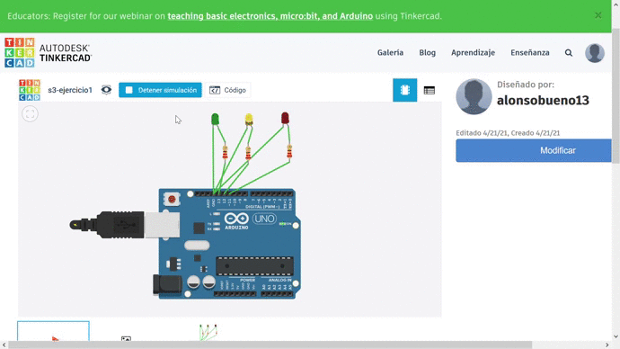

# Práctica 3: Experimentación con Arduino

Alumnos que la han desarrollado:
* Alonso Bueno Herrero
* Bartolomé Zambrana Pérez

Contenido de esta documentación:
* SEMINARIO
  - Ejercicios 1 y 2
* PROYECTOS DE "AMPLIACIÓN"
  - Proyectos 1 y 2

Nota: debido a que Fritzing, en su web, exigía pagar para descargar el software, se ha usado el simulador de Tinkercad para las fases de diseño y simulación del circuito. 

## SEMINARIO: Ejercicio 1: Parpadeo de LED básico

Esquema del circuito: 


Componentes eléctricos usados:
* Placa ARDUINO
* 3 Resistencias de 220 ohmios
* 3 leds rojo, amarillo y verde
* cables para conexiones

<video width="320" height="240" controls>
  <source src="s3-ejercicio1.mp4" type="video/mp4">
</video>


Código del programa:


```C
void setup()
{
  pinMode(11, OUTPUT);
  pinMode(12, OUTPUT);
  pinMode(13, OUTPUT);
  
  //pinMode(pulsador, INPUT);
}

void loop()
{
  
  
  // LED rojo 
  digitalWrite(11, HIGH);
  delay(1500); // Wait for 1500 millisecond(s)
  digitalWrite(11, LOW);
  delay(1500); // Wait for 1500 millisecond(s)
  
  // LED amarillo 
  digitalWrite(12, HIGH);
  delay(1500); 
  digitalWrite(12, LOW);
  delay(1500); 
  
  // LED verde  
  digitalWrite(13, HIGH);
  delay(1500); 
  digitalWrite(13, LOW);
  delay(1500); 
}
```

Funcionamiento:




## SEMINARIO: Ejercicio 2: Parpadeo de LED con interruptor

Esquema del circuito:


Componentes eléctricos usados:
* Placa ARDUINO
* 4 Resistencias de 220 ohmios
* 3 leds rojo, amarillo y verde
* cables para conexiones
* Interruptor* 

(*) Para conectar un interruptor y captar su estado, nos hemos apoyado en lo expuesto en [este blog](http://www.practicasconarduino.com/manualrapido/montaje_1_interruptor.html) educativo de Arduino, muy interesante.

Código del programa:

```C
// variable para controlar el interruptor


int pulsador=7;
int estado;

void setup()
{
  Serial.begin(9600);       //Iniciamos la lectura por puerto serie.
  pinMode(pulsador, INPUT);
  
  pinMode(11, OUTPUT);
  pinMode(12, OUTPUT);
  pinMode(13, OUTPUT);
  
  //pinMode(pulsador, INPUT);
}


void loop()
{
  
  estado = digitalRead (pulsador);
  Serial.println(estado);
  
  if (estado == HIGH) {
  	// LED rojo 
    digitalWrite(11, HIGH);
    delay(1500); // Wait for 1500 millisecond(s)
    digitalWrite(11, LOW);
    delay(1500); // Wait for 1500 millisecond(s)
  
  }
  else {   
    // LED amarillo 
    digitalWrite(12, HIGH);
    delay(1500); 
    digitalWrite(12, LOW);
    delay(1500); 

    // LED verde  
    digitalWrite(13, HIGH);
    delay(1500); 
    digitalWrite(13, LOW);
    delay(1500); 
  }
}
```

Funcionamiento:


## PROYECTO EXTRA 1: Secuencia de LEDs, encendiendo y apagando 4 LEDs secuencialmente, de forma similar a las lucecitas de "El coche fantástico"

Esquema del circuito:


Componentes eléctricos usados:

* 4 LEDs rojos
* 4 resistencias de 220 ohmios
* Cableado para conexiones
* Placa Arduino 
* Placa de pruebas pequeña (para facilitar conexiones, debido a que este proyecto es algo más complejo y conviene dejar lo más "limpio" posible el circuito)

Código del programa:

```C++
int ROJO1 = 13;
int ROJO2 = 12;
int ROJO3 = 11;
int ROJO4 = 10;

void setup()
{
  pinMode(ROJO1, OUTPUT);
  pinMode(ROJO2, OUTPUT);
  pinMode(ROJO3, OUTPUT);
  pinMode(ROJO4, OUTPUT);

 
}

void loop()
{
  //Luz de izquierda a derecha
  for(int i = 0 ; i < 4; i++){
  	digitalWrite(13 - i,HIGH);
    delay(500);
    digitalWrite(13 - i,LOW);
    delay(500);
  } 
  
  //Luz de derecha a izquierda
  for(int i = 0; i < 4; i++){
  	digitalWrite(10 + i,HIGH);
    delay(500);
    digitalWrite(10 + i,LOW);
    delay(500);
  } 
}
```

Funcionamiento:


## PROYECTO EXTRA 2: Alarma por detección de presencia.


Esquema del circuito:


Componentes eléctricos usados:

* Sensor PIR (detección de presencia)
* LED rojo
* Resistencia de 220 ohmios
* Cableado para conexiones
* Placa Arduino 
* Placa de pruebas pequeña


Código del programa:

```C++
int ROJO = 13;
int DETECTOR = 7;

void setup()
{
  pinMode(ROJO, OUTPUT);
  pinMode(DETECTOR,INPUT);
}

void loop()
{
  int estado = digitalRead(DETECTOR);
  digitalWrite(ROJO,estado);
}
```

Funcionamiento:

