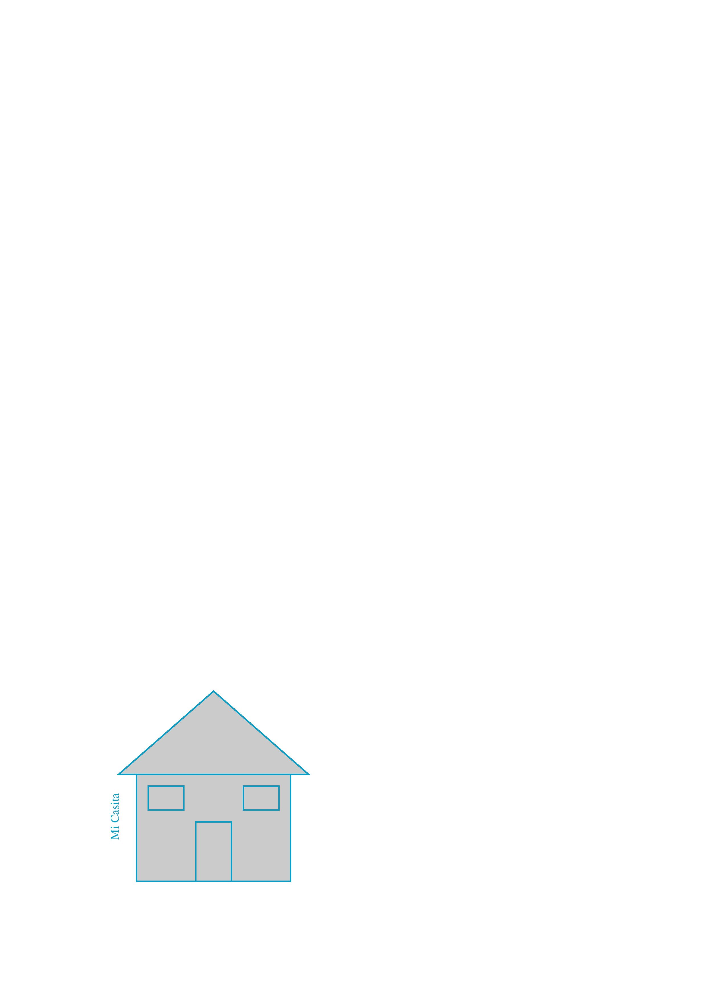
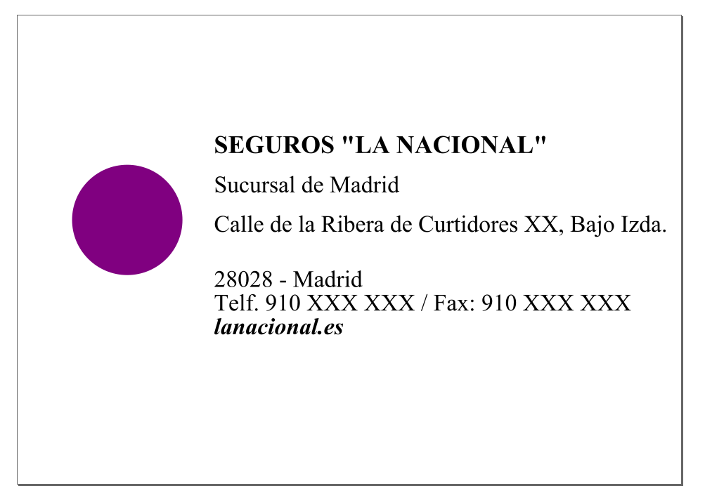

# P4 - Postscript

Elaborado por:

* ALONSO BUENO HERRERO
* BARTOLOMÉ ZAMBRANA PÉREZ 

## Ejercicio 1

### Código Postscript

```
%!PS
%% Inicializamos el objeto que vamos a dibujar.

	%%Dibujamos un triángulo (techo)
	newpath
	100 190 moveto 
	260 190 lineto
	180 260 lineto
	closepath %cierro el path para que una con el vértice de apertura.

		%% Guardamos el path
		gsave

		%% Establecemos el color de relleno.
		0.75 setgray
		fill

		%% Restauramos el path ya que el fill lo destruye.
		grestore

		%% Establecemso el color de la línea azul claro.
		0.05 0.613 0.765 setrgbcolor
		stroke 
	
	%% Dibujamos un rectángulo (paredes).
	newpath
	115 100 moveto
	245 100 lineto
	245 190 lineto
	115 190 lineto
	closepath 

		%% Guardamos el path
		gsave

		%% Establecemos el color de relleno.
		0.75 setgray
		fill

		%% Restauramos el path ya que el fill lo destruye.
		grestore

		%% Establecemso el color de la línea azul claro.
		0.05 0.613 0.765 setrgbcolor

		%% Cerramos el objeto a dibujar
		stroke

	%% Dibujamos un rectángulo (puerta).
	newpath
	165 100 moveto
	195 100 lineto
	195 150 lineto
	165 150 lineto
	closepath 

		%% Guardamos el path
		gsave

		%% Establecemos el color de relleno.
		0.75 setgray
		fill

		%% Restauramos el path ya que el fill lo destruye.
		grestore

		%% Establecemso el color de la línea azul claro.
		0.05 0.613 0.765 setrgbcolor

		%% Cerramos el objeto a dibujar
		stroke

	%% Dibujamos un cuadrado (ventana derecha).
	newpath
	205 160 moveto
	235 160 lineto
	235 180 lineto
	205 180 lineto
	closepath 

		%% Guardamos el path
		gsave

		%% Establecemos el color de relleno.
		0.75 setgray
		fill

		%% Restauramos el path ya que el fill lo destruye.
		grestore

		%% Establecemso el color de la línea azul claro.
		0.05 0.613 0.765 setrgbcolor

		%% Cerramos el objeto a dibujar
		stroke

	%% Dibujamos un cuadrado (ventana izquierda).
	newpath
	125 160 moveto
	155 160 lineto
	155 180 lineto
	125 180 lineto
	closepath 

		%% Guardamos el path
		gsave

		%% Establecemos el color de relleno.
		0.75 setgray
		fill

		%% Restauramos el path ya que el fill lo destruye.
		grestore

		%% Establecemso el color de la línea azul claro.
		0.05 0.613 0.765 setrgbcolor

		%% Cerramos el objeto a dibujar
		stroke

	%% Dibujamos texto que establezca Mi casita.
	/Times-Roman findfont
	10 scalefont
	setfont

	newpath
	100 135 moveto

	gsave
	90 rotate
	(Mi Casita) show
	grestore


%% Dibujamos la página.
showpage
```

### Resultado



## Ejercicio 2

### Código Postscript

```
%!PS-Adobe-3.0

% Configurar tipografía

<< /PageSize [842 595] >> setpagedevice

/Times-Bold findfont % Get the basic font
32 scalefont % Scale the font to 20 points
setfont % Make it the current font

% Dibujar el texto
newpath 

250 420  moveto
(SEGUROS "LA NACIONAL" ) show 

% cambiar letra a regular (no negrita) para el resto de datos 
/Times-Roman findfont % Get the basic font
30 scalefont % Scale the font to 20 points
setfont % Make it the current font

250 370 moveto 
(Sucursal de Madrid) show 
250 320 moveto 
(Calle de la Ribera de Curtidores XX, Bajo Izda. ) show
250 250 moveto 
(28028 - Madrid) show
250 220 moveto
(Telf. 910 XXX XXX / Fax: 910 XXX XXX) show

% cambiar letra a negrita-cursiva para la web
/Times-BoldItalic findfont % Get the basic font
30 scalefont % Scale the font to 20 points
setfont % Make it the current font

250 190 moveto
(lanacional.es) show

% dibujar circunferencia
  140 335 moveto   
% x y R angI angF
  140 335 70 0 360 arc  
0.5 0 0.5 setrgbcolor   % rellenar circunferencia
fill

stroke    % fin

showpage   % imprime  
```

(Nota: todos los nombres propios de personas (físicas o jurídicas) aquí presentes son meras invenciones usadas para ilustrar la resolución de los ejercicios. Todo parecido con la realidad es pura coincidencia.) 

### Resultado

