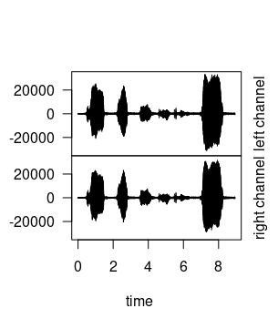
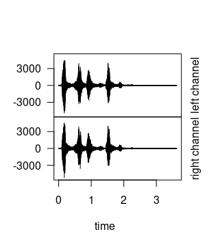
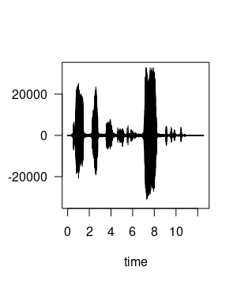
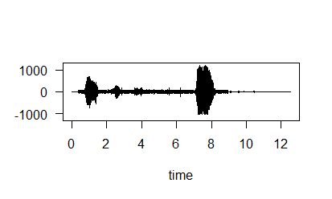

# Práctica 5: Sonido con R

REALIZADA POR:
- Bartolomé Zambrana Pérez 
- Alonso Bueno Herrero

## Introducción.

Antes de comenzar esta práctica hemos desarrollado las siguientes tareas:

- Instalar y configurar RStudio.

- Instalar librerías necesarias (*tunerR, seewave, audio*).

  ```R
  library(tuneR)
  library(seewave)
  library(audio)
  ```

- Establecer el directorio de ejecución del script:

  ``` R
  setwd('<ruta del escritorio de ejecución>')
  ```

## 1. Leer dos ficheros de Sonido (WAV o MP3) de unos pocos segundos de duración cada uno.

Cabe destacar que tenemos que distinguir la lectura de un sonido WAV a un sonido MP3 debido al hecho de que la llamada a función es distinta, como podemos observar a continuación:

```R
#Lectura del audio de un perro, formato WAV.
perro <- readWave('./S-varios-sonidos/perro.wav')

#Lectura del audio de un gato, formato MP3
gato <- readMP3('./S-varios-sonidos/gato.mp3')
```


## 2. Dibujar la forma de onda de ambos sonidos.

Para la representación de la longitud de onda  accedemos en primer lugar a su propiedad *right* aplicándole la función *length* obteniendo la longitud de la onda. Posteriormente se dibuja mediante la función *plot* junto con *extractWave*

### Forma de onda del gato.

```R
longitud_gato <- gato@right
plot(extractWave(gato,from = 1, to = length(longitud_gato)))
```



### Forma de onda del perro.

```R
longitud_perro <- perro@right
plot(extractWave(perro,from = 1, to = length(longitud_perro)))
```



## 3. Obtener la información de las cabeceras de ambos sonidos.

Usamos la función `str`: 

- Información de cabecera del gato

```R
#Información de cabecera gato.
str(gato)
```

- Información de salida obtenida:

```
Formal class 'Wave' [package "tuneR"] with 6 slots
   ..@ left     : int [1:393984] 0 0 0 0 0 0 0 0 0 0 ...
   ..@ right    : int [1:393984] 0 0 0 0 0 0 0 0 0 0 ...
   ..@ stereo   : logi TRUE
   ..@ samp.rate: num 44100
   ..@ bit      : num 16
   ..@ pcm      : logi TRUE
```

- Información de cabecera del perro

```R
#Información de cabecera perro
str(perro)
```

- Información de salida obtenida:

```
Formal class 'Wave' [package "tuneR"] with 6 slots
   ..@ left     : int [1:159732] 0 0 0 0 0 0 0 0 1 1 ...
   ..@ right    : int [1:159732] 0 0 0 0 0 0 0 0 1 1 ...
   ..@ stereo   : logi TRUE
   ..@ samp.rate: int 44100
   ..@ bit      : int 16
   ..@ pcm      : logi TRUE
```
## 4. Unir ambos sonidos en uno nuevo.

Para unir ambos audio hemos de utilizar la función *pastew* estableciendo el formato de salida en el atributo *output* en nuestro caso *Wave*

```R
unido <- pastew(perro,gato,output = "Wave")
```

Finalmente, comprobamos que la longitud obtenida es el resultado de la suma de la longitud de los dos sonidos anteriores, estando bien unido:

```R
#Comprobamos que coinciden en longitud
  if(length(unido@left) == length(longitud_gato) + length(longitud_perro)){
    "coinciden en longitud"
  }else{
    "no coinciden en longitud"
  }
```

Obteniendo el siguiente resultado:

``` 
[1] "coinciden en longitud"
``` 

## 5. Dibujar la forma de onda de la señal resultante.

El procedimiento es el mismo que en el ejercicio 2.

```R
plot(extractWave(unido,from = 1, to = length(unido@left)))
```

Obteniendo el siguiente resultado:



## 6. Pasarle un filtro de frecuencia para eliminar las frecuencias entre 10000Hz y 20000Hz

```R
# aplicar filtro
unido_filtrado <- bwfilter(unido, n=1, from = 10000, to = 20000,
                           bandpass = TRUE, listen = FALSE, output = "Wave")

# imprimir la señal de onda del sonido resultante 
plot(extractWave(unido_filtrado, from = 1, to = length(unido_filtrado@left)))
```
Al aplicar el filtrado, la función `bwfilter` recibe el rango de frecuencias mínima y máxima que queremos que se elimine, y fijamos también con el argumento `output` el tipo de sonido de salida (onda, *Wave*). 

Resultado:



## 7. Almacenar la señal obtenida como un fichero WAV denominado “mezcla.wav”.

Usamos la función `writeWave`:

```R
writeWave(unido_filtrado, file.path("S-varios-sonidos/mezcla.wav"))
```

Resultado: (en la carpeta `S-varios-sonidos`)

## 8. Cargar un nuevo archivo de sonido, aplicarle eco y a continuación darle la vuelta al sonido. Almacenar la señal obtenida como un fichero WAV denominado “alreves.wav”

```r
sicut <- readMP3("S-varios-sonidos/sicut_locutus_est.mp3")
sicutECO <- echo(sicut,f=22050,
                amp=c(0.8,0.4,0.2),
                delay=c(1,2,3), 
                output="Wave")
sicutECO@left <- 10000 * sicutECO@left
# listen(sicutECO , f= 22050)

# dar la vuelta al sonido
alreves <- revw(sicutECO, output = "Wave")

# escribir en un nuevo WAV el resultado
writeWave(alreves, file.path("S-varios-sonidos/alreves.wav"))
```

Resultado: (ver fichero `alreves.WAV` en la carpeta `S-varios-sonidos`)