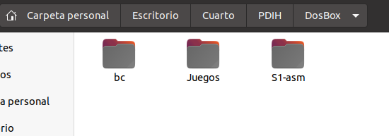
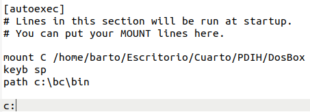
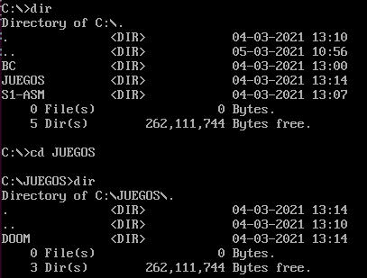
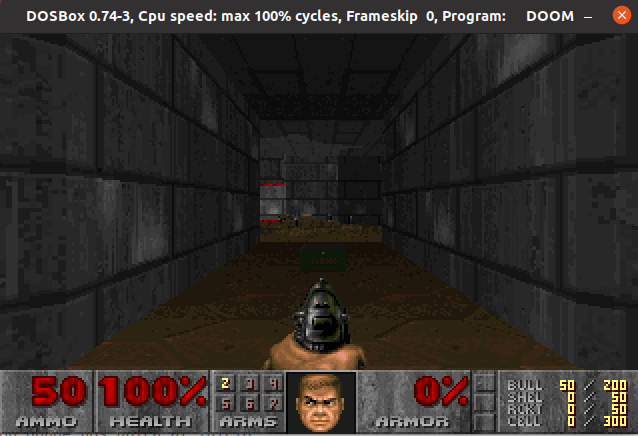
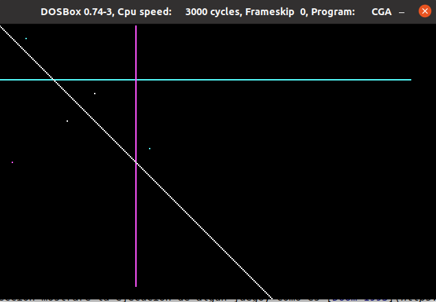
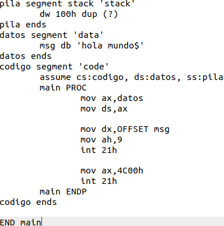
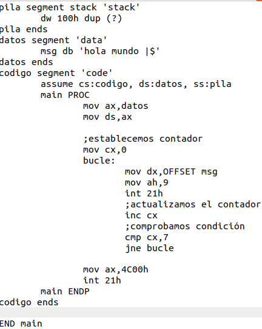

# Seminario 1: Programación de dispositivos a bajo nivel

**Realizado por Bartolomé Zambrana Pérez.**
***
## Instalación y configuración de DOSBOX.

En mi caso me encuentro en **Ubuntu 20.04** por lo que la manera más sencilla de instalar  **DOSBOX** es realizar el siguiente comando por terminal.

> sudo apt install dosbox

Tras esto, establecemos el directorio de trabajo en la máquina anfitriona, en mi caso se sitúa en 

> */home/barto/Escritorio/Cuarto/PDIH/DOSBOX* 

introduciendo en esta carpeta todo el contenido aportado por el profesor de la asignatura:

- Bc
- Juegos
- S1-asm

Esto lo podemos observar en la siguiente captura de pantalla:

Por consiguiente, establecemos la configuración de inicio de DosBox. Para ello, nos desplazamos al archivo de configuración de DOSBOX situado en:

>*~/.dosbox/dosbox-0.74-3.conf*

En dicho fichero de configuración tenemos que buscar una regla llamada **[autoexec]**, debajo de la que establecemos lo siguiente para que se realice en el inicio de DOSBOX:

> Montar la unidad **C** en el directorio donde se encuntra establecido el entorno de pragramación Borland C, junto con nuestro contenido de trabajo.

* mount C /home/barto/Escritorio/Cuarto/PDIH/DosBox

> Configurar el teclado en español

* keyb sp

> Establecemos el path del ejecutable del BC

* path c:\bc\bin

> Localización del inicio.

* c:

En la siguiente captura se muestra estas líneas:

## Ejecutar aplicaciones, así como programas.

En esta sección mostraré la ejecución de algún juego, como es [Doom 1993](https://www.dosgamesarchive.com/download/doom/), estableciéndolo en nuestra carpeta de trabajo.

Una vez obtenemos el documento zip lo descomprimimos desde la máquina anfritiona, de modo que desde DOSBOX podemos observar en la carpeta juegos el siguiente contenido:

Accediendo a la carpeta denominada DOOM ejecutamos DOOM.EXE comenzando el juego tras establecer el mapa en el que queremos jugar como se puede observar:

A continuación muestro la ejecución del programa de ejemplo *CGA* para comprobar también la correcta instalación de DOSBOX:

## Crear el ejemplo “Hola mundo” en ensamblador, compilarlo y comprobar su funcionamiento. A continuación incluir un bucle para mostrar el mensaje 7 veces.

En primer lugar, establecemos el código en ensamblador para establecer la cadena *Hola mundo*, basándonos en los programas de ejemplo aportados por el profesor de la asignatura.

Siendo este el código establecido:

Obteniendo como resultado de ejecución lo siguiente:

Comencemos la segunda parte de este ejercicio, consiste mostrar el mismo mensaje 7 veces mediante un bucle, fundamentándonos en el ejemplo establecido en el guión del seminario 1. Por consiguiente, el código ensamblador obtenido es :

Cabe decir que el mensaje lo he establecido como *Hola mundo |* para que se pueda diferenciar rápidamente los distintos hola mundos.

Resultado tras su ejecución:

